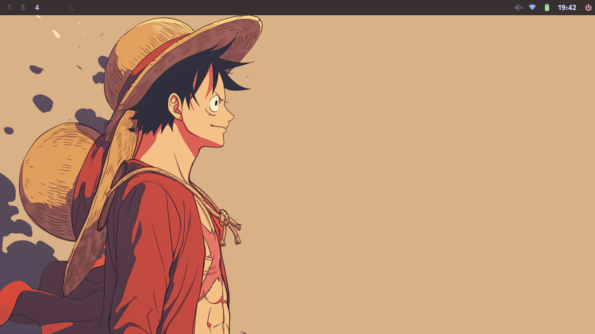

<h2 align="center">akritbehera27/hyprdots</h2>

    

This is what I have and these are all of my dotfiles.

Feel free to copy any of the dotfiles or scripts you find here, as much of it is just copied from others' dotfiles. I wouldn't recommend cloning my entire setup, but instead to try copying bits and pieces as you put together your own dotfiles unique to you.

In the future I'm planning on adding an install script to make it easier for others to use my configs. For now, you'll have to piece things together yourself, though.

### Software's List

Hear is the list of software that is use daily if

- Os : arch linux
- Display server : wayland
- Compositro : Hyprland
- Top bar : waybar
- menues : rofi
- notification : dunst
- Sehll: zsh
- editor: nvim 
- terminal : kitty
- browser : firefox

A more detailed list could be found in ` "resources/package list.txt" `

### Where is everything?

Most config files for various programs can be found in the `.config` directory. Shell scripts can be found in the `.local/bin` directory. For Zsh use zsh-configs, environment variables can be found in `.zshenv`and zsh configs in `.zshrc` . for vim plugins use `.vim` directory

### Additional Steps:

You can Automate the process of  " auto login" for tty1 in you arch linux given in [autologin](https://wiki.archlinux.org/title/Getty#Automatic_login_to_virtual_console) , additionally you can also "Hide the grub bootmenu" by following the guid given in [grub tricks](https://wiki.archlinux.org/title/GRUB/Tips_and_tricks#Hide_GRUB_unless_the_Shift_key_is_held_down)
